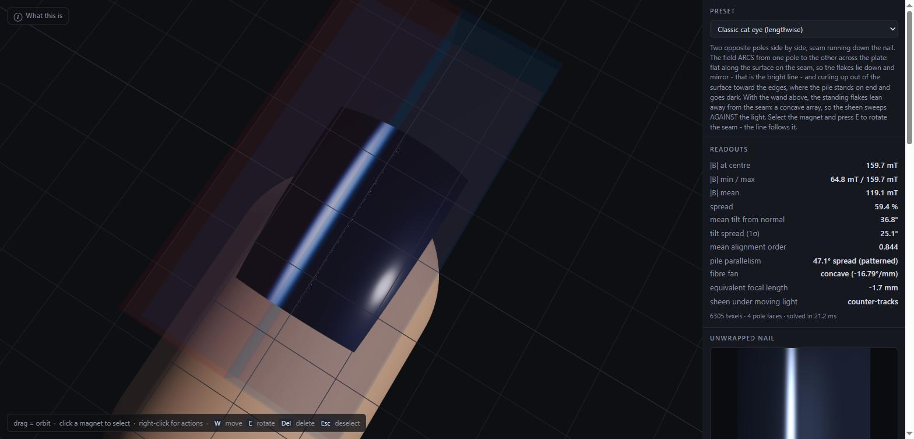

# Magnetic lacquer sandbox

A 3D sandbox for previewing magnetic nail polish (cat-eye / velvet) finishes.
The magnetic field is solved exactly from a surface-charge model; the finish is
then *inferred* from that field and shaded with an anisotropic fibre BRDF.


*The classic cat eye. The wand is drawn translucent above the finger; the traced
field lines arc from one pole to the other across the plate, lying flat along
the seam — which is exactly where the flakes lie down and mirror, and why the
bright line falls there.*



**This is a physics-driven shading preview, not a simulation of the polish.**
There is no fluid model and no particle collisions. It predicts where the flake
pile points, not how the polish flows.

It does now have a **clock**. With it running, each texel carries an ensemble of
flakes that turn at a finite rate against the viscous drag of the polish, and
the polish thickens as it dries — which is enough to reproduce the techniques
that depend on *moving* the tool, and to say when they will and will not work.

```
npm install
npm test      # 240 tests: field solver, finish model, dynamics, validation
npm run dev   # http://localhost:5173
```

---

## The field solver

### Surface-charge (Gilbert) model

A uniformly magnetised body of magnetisation **M** is equivalent to a magnetic
surface charge `sigma_m = M . n` on its boundary. Every magnet here is
magnetised along its own local **+Z**, so only its two end faces are charged and
a cuboid magnet is *exactly* two uniformly charged rectangles.

The code carries `sigmaB = mu0 * sigma_m` (in tesla) rather than `sigma_m`,
because for a face whose normal is parallel to **M** that combination is exactly
the remanence `Br`. A `Br = 1.30 T` magnet therefore has `sigmaB = +1.30` on its
north face and `-1.30` on its south. `mu0` never appears in the field path.

`mu_r ~ 1.05` for NdFeB, so magnetisation is treated as fixed: no demagnetising
solve, no mutual magnetisation, and the field of several magnets is a plain
vector sum.

### Rectangular pole face — closed form (`src/core/rect.js`)

Substituting `u = x - x'`, `v = y - y'` makes the surface integral separable
with elementary antiderivatives, evaluated as a double difference over the four
corners:

| component | antiderivative |
|---|---|
| `Bx` | `-ln(v + R)` |
| `By` | `-ln(u + R)` |
| `Bz` | `atan(u*v / (z*R))` |

with `R = sqrt(u^2 + v^2 + z^2)`.

Two things in that table are load-bearing, and both were caught by the tests:

* **`asinh`, not `ln`.** `-ln(v + R)` cancels catastrophically for `v << 0`. The
  identical `-asinh(v / sqrt(u^2 + z^2))` differs only by a term that depends on
  `(u, z)` alone, which cancels exactly in the `v`-difference — so it is free,
  and it is what lets the formula hold up 10 microns off the face.
* **`atan`, not `atan2`.** The two agree only while `z*R > 0`. For `z < 0`
  `atan2` jumps a branch and the double difference picks up a spurious `2*pi`,
  i.e. a constant error of exactly `sigmaB` in `Bz` on the far side of the sheet.

Evaluating *on* the sheet returns the **principal value** (the average of the two
sides). That matters the moment two magnets are stacked face to face: a
one-sided limit lets a sheet exert a force on itself, and a snapped pair then
reports a repulsive force.

### Circular pole face (`src/core/disc.js`)

No elementary closed form exists off-axis — the exact answer needs elliptic
integrals of the third kind. But a disc is a stack of concentric charged
**rings**, and a ring's field is exact in terms of complete elliptic integrals of
only the **first and second** kind:

```
I0 = INT dtheta / |p-r'|     = 4 K(m) / sqrt(a+)
I1 = INT dtheta / |p-r'|^3   = 4 E(m) / (sqrt(a+) a-)
```

with `a+ = (rho+r)^2 + z^2`, `a- = (rho-r)^2 + z^2`, `m = 4*rho*r/a+`. That
collapses the surface integral to a single adaptive radial quadrature.

This is not just elegance. Brute-force 2D adaptive quadrature took **4162 ms**
per nail solve; the ring formulation takes **60 ms** — a 69x speedup that is the
difference between a usable sandbox and a slideshow.

The other cost that mattered was not in the field solver at all. `computeFinish`
recomputed each row's arc width per texel, making it quadratic in the
across-nail resolution — **18.6 ms down to 3.0 ms** once the per-row widths are
cached. That one is on the path of every frame with the clock running, so it
sets the interactive resolution ceiling.

### Composite magnets (`src/core/magnet.js`)

* **horseshoe** — two legs of opposite polarity. The yoke is drawn but treated as
  soft iron rather than charged: that is the standard approximation and it avoids
  the spurious corner charges you get from bending a uniformly magnetised body
  around a right angle. Net charge is still zero, so `div B = 0` holds exactly.
* **ring** — an annular pole face. Needs no new field kernel: the field is
  linear in the charge distribution, so an annulus is a positive disc with a
  negative one punched out of it. On axis close in, the return flux through the
  hole reverses the field relative to the far field — the signature of a ring.
* **array** — a pre-patterned tool: a tiled grid of small magnets. `stripe` and
  `checker` alternate polarity, producing multi-line effects. `halbach` rotates
  each cell's magnetisation a quarter turn instead of flipping it, which
  reinforces the field on one face and cancels it on the other: **231 mT on one
  side against 16 mT on the other**, versus 46/46 for the stripe.

---

## Validation

`npm test` — 240 tests. Everything below runs headlessly, and the solver was
finished and green before any UI existed.

### The gate: analytic vs quadrature (`tests/rect.test.js`)

The closed form is checked against brute-force numerical quadrature to better
than **0.5%** at:

* on-axis distances spanning `0.01 mm` to `500 mm` (four decades),
* a scatter of off-axis points, both signs of `z`,
* **10 microns off the face** over the middle of the sheet,
* **at and just outside the corners and edges**.

The reference integrator refines adaptively — a panel splits whenever it is
still large compared with its own distance to the field point. A uniform tiling
is hopeless here: at 1 micron off a 20 mm face it would need ~10^8 tiles.

### The four required tests (`tests/validation.test.js`)

1. **Single cuboid vs the closed-form axial formula.** Agrees to 1e-9 relative,
   including through the full transform path with the magnet translated and
   rotated arbitrarily.
2. **Two magnets side by side.** Same polarity repels laterally, opposite
   attracts, forces obey Newton's third law to 1e-6, and fall off faster than
   `1/r^4`.
3. **Like poles across a gap.** A true null at the centre (`|B| < 1e-12`),
   isolated, reachable by Newton from scattered starts. Just off it *along the
   axis* the field is perpendicular to the mid-plane; *within* the mid-plane it
   is tangent to it and radial. Together, that is the saddle.
4. **Field lines never cross.** Streamlines traced from many seeds in a symmetry
   plane, checked pairwise for transversal intersection. Zero crossings for a
   single bar, for like poles across a gap, and for a messy three-magnet
   arrangement.

Plus `div B = 0` and `curl B = 0` numerically — the actual reason test 4 can
pass — and exact superposition.

Two notes on test 4, because both were initially wrong in ways that looked like
physics bugs:

* **Seeding.** Seeds must lie on a surface each field line crosses *exactly
  once*. A circle around a bar magnet is wrong — every line leaves and re-enters
  it, so seeds come in pairs on the same line and you end up comparing a line
  against a jittery second copy of itself. The equatorial / mid plane is the
  right choice.
* **Integration.** The field has a logarithmic singularity along every pole-face
  **edge**. Fixed-step RK4 sails straight through it and produces trajectories
  that visibly cross. The integrator uses step-doubling error control; with it,
  crossings went from 3958 to 0.

### Also covered

* Elliptic integrals against known values; the ring field against the textbook
  on-axis result; the disc against both brute-force quadrature and the exact
  on-axis solid-angle formula.
* Nail geometry: arc length is preserved as curvature increases (a true circular
  arc, not a parabola — a 16x12 nail stays 16x12 however hard it is arched), and
  analytic normals agree with numerical ones.
* The snap helper: snapped pairs genuinely attract, verified with the force
  integrator.
* Every preset and every magnet-type switch solves to finite, in-range values,
  including a magnet touching the nail.

---

## Three finishes, one polish

What separates them is the *shape of the field over the nail* — not the polish,
and often not even the tool. Two numbers tell them apart: **pile parallelism**
(how much the flake direction varies across the nail) and **mean tilt** (how far
the pile leans from the surface normal).

| finish | parallelism | mean tilt | what you see |
|---|---|---|---|
| **cat eye** | large — pile *turns* | mixed | a sharp bright line |
| **velvet** | small — one nap | ~78°, lying flat | even all-over bloom |
| **reverse velvet** | small — one nap | ~9°, standing | no sheen; base coat reads through |

Measured across the presets:

```
catEye          37 deg tilt   47.4 deg parallelism   160 mT   cat eye
catEyeBelow     52            50.8                   160      cat eye
velvet          78             8.5                   117      velvet
reverseVelvet    9             6.6                   117      reverse velvet
velvetWide      57            19.3                   282      soft / velvety
```

Velvet and reverse velvet are *equally uniform*; they differ only in tilt. One
lies flat, the other stands on end.

### Cat eye: a transition, not a pole

A cat eye is an **N-to-S transition**, not a pole. The tool presents both
poles to the plate side by side; along the seam between them the field lies flat
*in* the surface, so the flakes lie down and mirror — that is the bright line. A
few millimetres either side the field has curled up out of the plate, the pile
stands on end and goes dark. Rotating the tool rotates the seam, and the sheen
rotates with it.

Aiming a **single pole face** at the nail gives something else entirely: the
field is roughly normal to the plate, the pile stands up almost everywhere, and
there is no sheen at ordinary viewing angles — only a flare at extreme ones.
That is **reverse velvet**.

### Velvet: hold it back

In the salon, velvet is the **same wand held parallel and farther from the
nail** — the pull widens, the seam spreads over the whole plate, and the pile
stops turning. The sandbox makes the trade-off obvious: distance alone guts the
field (160 mT at 7 mm down to 3 mT at 26 mm), so a real velvet magnet is also a
*bigger* one. The `velvetWide` preset uses a larger wand held back, which keeps
282 mT while cutting the parallelism spread from 47° to 19°.

### Reverse velvet: the geometry fights you

The usual tool is a **horseshoe turned a quarter turn**, so one pole sits above
the nail and one below and the field crosses straight *through* the plate.

Measured against a real finger, it is a poor tool, and the reason is worth
stating because it is not a matter of technique. The gap has to clear the whole
**fingertip** — about 18 mm — not just the nail, so it cannot be small, and the
nail therefore sits well off the centre line of a gap it cannot be centred in.
Searching over gap, leg length, leg width and placement, subject to the tool
staying outside the finger, the best arrangement found still leaves the pile
39° off the normal with 18° of spread.

Two ordinary discs pinching the fingertip — one over the nail, one against the
pad — beat it on every measure: **244 mT against 109, and a field uniform to 6°
against 18°**. That is the `reverseVelvetClamp` preset.

What is left over is not the magnet's fault either. Even in a perfectly uniform
vertical field the mean tilt sits near 21°, because **the nail curves away
underneath it**: at a typical arch the surface normal at the sidewall is already
29° off vertical. Flatten the nail in the GUI and the tilt collapses to the
field's own few degrees of non-uniformity. Perfect reverse velvet on a curved
nail is impossible with any parallel field, which is exactly why the finish
always flares at the sidewalls.

A single bar magnet is worse again: perpendicular only on its axis, giving a
dark core with a bright rim rather than an evenly dead surface. The `discUmbra`
preset is that case, kept as the contrast.

### Cat eye vs reverse velvet, in profile

The two are inverted tilt profiles across the nail, which is how the tests tell
them apart (angle from the surface normal, sampled across the width):

```
cat eye          24   9   8  27  47  68  [90]  68  47  27   8   9  24
reverse velvet   79  69  58  45  31  16   [0]  16  31  45  58  69  79
```

The cat eye peaks at the seam (flat, mirroring); the single-pole version dips to
zero there (standing, dark) and only lies over at the arched rim. Presenting both
poles is also far stronger, because it puts both faces down near the plate:
**160 mT** at the nail for the wand, against 78 mT for a pole face aimed down and
20 mT for an end-magnetised bar held across.

The taxonomy above follows how nail techs actually describe and produce these
finishes; see the sources at the end of this file.

### Verified in the browser

The rendering was checked in a real browser, not just reasoned about:

* The shader compiles and runs — `gl.getError() == 0`, context not lost.
* No console errors across all 8 presets, 5 live magnet-type swaps, and all 12
  render/unwrap channel changes; every readout finite.
* Click-to-select, the translate and rotate gizmos, and the live re-solve all
  work: rotating the wand moved `|B|` at the nail centre from 159.7 to 189.6 mT
  and the spread from 59.4% to 91.1%, resolving in 28 ms.

**The sheen reversal was measured, not eyeballed.** Driving the light along its
straight travel line and tracking the bright line's position in the unwrapped
view (which shades head-on, so camera orientation cannot confound it):

| preset | fan | sheen position as the light moves +x | verdict |
|---|---|---|---|
| `catEye` (wand above) | concave, -16.8 deg/mm | 0.574 → 0.559 → 0.542 → 0.522 → 0.502 → 0.483 → 0.463 → 0.445 | **counter-tracks** |
| `catEyeBelow` | convex, +9.8 deg/mm | 0.412 → 0.431 → 0.453 → 0.477 → 0.502 → 0.528 → 0.551 → 0.573 | **tracks** |

Monotonic at every step, with a brightness-weighted centroid and an independent
peak-column measure agreeing exactly, at two different light travel ranges. The
convex array moves its highlight with the source and the concave one against it,
as the mirror analogy requires — and nothing in the shader encodes that.

`window.__app` exposes the scene so this can be re-run from the console.

---

## The finish model (`src/core/finish.js`)

Per texel, from **B**:

| quantity | model |
|---|---|
| chain direction | unit **B**, oriented into the outward hemisphere (flakes are nematic) |
| tilt | angle to the surface normal; ~0 = pile stands up, ~90 = lies flat |
| concentration | monotonic in a chosen driver, normalised, exponent on a slider |
| alignment order | zero below a threshold, then `1 - exp(-(\|B\| - thr)/sat)` |

### Orientation vs transport

Two distinct effects act on a magnetic flake, and the informal literature tends
to conflate them:

* **Rotation**, `tau = m x B` — instantaneous, and what produces the sheen. It
  depends on field *direction* only. This is the whole mechanism for the cat eye,
  which is why the effect falls out of a purely static solve.
* **Translation**, `F = grad(m . B)` — for an induced moment `m ∝ B` this is
  `(chi V / 2 mu0) grad(B^2)`. It moves particles up-gradient and changes local
  *density*, not direction. This is what "pulling the glitter" describes.

They also act on wildly different clocks, which is what makes "is it pulling the
glitter?" answerable rather than a matter of opinion. Measured across the
presets, **orientation outruns transport by a factor of about 1e4**: a flake has
finished turning long before it has measurably moved. Transport is implemented,
and off by default, because on the timescale of a real take it does nothing.

The model keeps them separate: chain direction is orientation, concentration is
a stand-in for transport. Concentration can be driven either way —
`fieldMagnitude` (where particles come to *rest*, i.e. maxima of `|B|`) or
`gradient` (`|grad(B^2)|`, the local *force*).

Worth knowing before reaching for the gradient option: measured across the
presets, the two agree closely. The full 3D `grad(B^2)` is dominated by the
component pointing at the magnet, so it correlates strongly with `|B|` and
mainly just sharpens the profile — which the exponent slider already does, at a
third of the cost. The genuinely different quantity would be the *in-surface*
gradient, which is what redistributes particles laterally across the nail.

### Which way does the sheen sweep?

The fan gradient — how the signed lean of the pile varies with distance from the
nail's medial line — is computed and reported. It is the quantity that decides
whether the flake array behaves as a convex or concave mirror:

It is a *gradient*, not a direction: what matters is whether the lean opens out
or closes in as you move off the centre line. Which one you get depends on the
geometry, and it is worth being precise, because it is easy to describe wrongly.

**A cat-eye wand (two poles side by side).** The field **arcs** from one pole to
the other across the plate. Nothing splays outward. Sampled across the nail:

| x from seam (mm) | −5 | −3 | 0 | +3 | +5 |
|---|---|---|---|---|---|
| B direction (x, z) | (−0.01, **+0.13**) | (−0.09, +0.12) | (**−0.16**, 0.00) | (−0.09, −0.12) | (−0.01, **−0.13**) |

Up on one side, flat along the surface in the middle, down on the other — one
continuous arc. That is why the seam mirrors and the edges go dark. With the
wand **above**, the arc dips down through the plate and the standing flakes lean
**away** from the seam: a **concave** array, sheen sweeps **against** the light.
With the wand **below**, the arc bows up through the plate and they lean
**toward** the seam: **convex**, sheen sweeps **with** the light.

**A single pole face aimed at the plate** (reverse velvet, or a disc). Here the
lines genuinely do converge into the face from above, or spread out of it from
below, and the same above/below rule falls out — but by a different mechanism.

This is asserted in the tests for both through-thickness and in-plane
magnetisation, and for both bar and disc magnets. It also exposed a genuine sign
bug: `cross(normal, along)` points *toward* the medial line, not away, which
silently inverted every convex/concave verdict.

Worth knowing: the nail's **own** curvature competes with the field fan. An
end-magnetised bar below a strongly arched nail can come out very nearly flat,
because the two effects cancel. The readout tells you which way it actually
landed rather than assuming.

Nothing about this is encoded in the shader. The Kajiya-Kay lobe peaks where
`angle(T,L) + angle(T,V) = pi`; the sweep direction falls out of *where* that
condition is met across a varying tangent field.

---

## Time: what the pile does while the polish dries

`src/core/dynamics.js`. The static model above answers *where does the pile end
up given all the time in the world*, which is the right question for a tool held
still. Every technique that involves **moving** the tool depends on the pile
lagging it, and needs a clock.

### One equation

A flake in polish is overdamped to an absurd degree — Reynolds number around
`1e-8`, inertia gone in under a nanosecond — so there is no oscillation and no
overshoot: viscous torque balances magnetic torque at every instant. The pigment
is magnetically soft and platelet shaped, so its moment is **induced** along the
applied field and its easy axis lies in the plane of the flake:

```
U = -(1/2) (chi V / mu0) B^2 cos^2(theta)
```

`cos^2`, not `cos` — a flake has no head and no tail, which is what makes the
pile **nematic**, and why the sheen never depends on which way round the magnet
is held. Balancing `-dU/dtheta` against rotational drag `zeta_r = 8 pi eta a^3`:

```
dtheta/dt = -k sin(theta) cos(theta),     k = chi B^2 / (6 mu0 eta)
```

which has an **exact** solution:

```
tan(theta(t)) = tan(theta_0) exp(-k t)
```

Two consequences worth pulling out.

**The flake radius cancels out of `k`.** Orientation does not care how big the
flakes are — only `chi`, `B` and viscosity. Transport does care: the drift
velocity keeps an `a^2`. That asymmetry is the whole reason orientation
dominates, and it is quantified below.

**The integrator is unconditionally stable**, because it is not an integrator —
it is the closed-form solution evaluated as `atan2(sin, cos * exp(k dt))`, which
stays accurate at both ends and treats an overflow to `Infinity` as the correct
"fully aligned" limit. Any timestep is legal. That is what makes a hand-driven,
real-time sim viable at all: a dropped frame costs accuracy in how `B` changed
during it, never stability, and there is no CFL condition to respect.

Gated the same way the field solver was — against brute-force RK4 of the ODE, to
1e-8, across the whole range including past 90°.

### Order is measured, not assumed

The static model needs an `orderThreshold` slider to say "below this field the
flakes stay random". In the time-resolved model that is not a parameter. Each
texel carries an **ensemble** of flakes; in a weak field they simply have not
finished turning when the coat sets, so the ensemble stays spread and the order
parameter comes out low on its own. The threshold becomes a consequence of the
drying time, which is the honest way round.

The ensemble is reduced with the nematic order tensor `Q = <n n^T>`, taking
`S = (3 lambda_max - 1) / 2` and the director from the dominant eigenvector by
power iteration seeded from the previous frame.

Starting the ensemble matters more than it looks. `N` *random* directions carry
a large-eigenvalue bias of order `1/sqrt(N)`, so a small random ensemble reports
`S ~ 0.3` when it is in fact completely disordered — sheen painted onto an
unmagnetised nail. Starting from a **Fibonacci hemisphere** under a random
per-texel rotation gives `S = 0.034` at 16 flakes, so "no field, no sheen" comes
out without a fudge.

### Polydispersity is load-bearing

Real pigment varies in size, thickness, aspect ratio and iron loading, so `k`
varies flake to flake. This is not a cosmetic detail — leaving it out gives
visibly wrong answers for every moving technique.

The alignment ODE is **contracting**. With a single `k`, every flake in a texel
converges onto the same trajectory and stays there; spin a magnet over a
monodisperse pile and the whole ensemble tracks it in lockstep with one common
phase lag, staying perfectly ordered. No scatter, no bead. Give the flakes a
spread of `k` and they fan out in *phase* instead — fast ones keep up, slow ones
lag, the ensemble smears around the cone the field is sweeping, and the order
parameter collapses. **That is the glass-bead finish.**

### Timescales, and why the static model was right all along

| | fresh (0.35 Pa·s) | 2 min | 3 min | 3.5 min |
|---|---|---|---|---|
| viscosity (Pa·s) | 0.35 | 35 | 355 | 2400 |
| align time @ 100 mT | 0.18 ms | 18 ms | 185 ms | 1.3 s |
| align time @ 10 mT | 8.9 ms | 0.9 s | 9.1 s | 60 s |
| drift @ 0.01 T²/mm | 0.27 mm/s | 2.7 µm/s | 0.27 µm/s | — |

Read the first column. In fresh polish a magnet held anywhere near a nail combs
the pile in **under a millisecond**. Nothing done slowly can possibly matter,
and only the final position of the tool leaves a mark — which is precisely why
the static model works so well, and why "hold it there for ten seconds" is
folklore rather than physics. Held still, the dynamic model reproduces
`computeFinish` to **0.007°** of mean director angle: the static model is its
long-time limit, and that is asserted in the test suite rather than assumed.

**Orientation outruns transport by four orders of magnitude.** At fresh
viscosity a flake finishes turning in 0.2 ms and needs about 4 s to drift 1 mm.
By the time it could have moved a visible distance, the polish has thickened
enough to stop it. This is the quantitative answer to whether "pulling the
glitter" drives the effect: it does not. Transport is implemented anyway
(conservative donor-cell upwind on the UV lattice, mass-conserving, no outflow
at the nail edge) and is **off by default**, so the claim can be checked rather
than taken on trust.

### The working window

What breaks the "everything is instant" regime is **thickening**. Viscosity
climbs as `eta(t) = eta0 exp(t / dryTime)`, so around three minutes in the
response time reaches human timescales and the pile starts to lag the tool. A
minute later the coat is set and nothing moves at all. Every moving technique
lives in that window, and the readout panel names the regime you are in — from
*instant — only where you finish matters* through *laggy — the working window*
to *set* — so it can be found rather than guessed at.

Gel does not dry: it holds its viscosity until it is cured, then freezes. So the
window is however long you want — and the effects that depend on lag are
therefore **unavailable on gel**. Spin a horseshoe over uncured gel and there is
no bead at all. Both directions are asserted in the tests.

### Being in the window is not enough: you have to lift the tool

The window says when a bead can be *made*. It says nothing about whether it
survives, and measuring that turned up the sharpest practical result here.

A bead is a fanned-out ensemble held in place by nothing at all. Stop turning
but leave the magnet sitting over the nail and its field is still there, so the
pile simply re-combs — the orientation ODE is contracting, and it converges on
the static answer as readily as it ever did:

| after the hand stops | tool left in place | tool lifted away |
|---|---|---|
| end of the 8 s spin | 0.696 | 0.696 |
| +1 s | 0.847 | 0.696 |
| +2 s | 0.958 | 0.696 |
| **+4 s** | **0.997** | **0.696** |
| +40 s | 1.000 | 0.696 |

**The whole bead is gone in about four seconds.** Drying cannot rescue it
either: at `startTime = 205 s` the coat does not reach `setViscosity` for
another **30 seconds**, long after the finish has re-aligned completely.

Lifting the tool removes the torque entirely, and with no torque a pile stays
where it is at any viscosity — the same mechanism that makes the multi-step
techniques work. So both glass-bead techniques now take their tool away when the
take ends, and it is asserted in the tests: leaving it costs more than 0.2 of
order, lifting it costs less than 0.001.

---

## Techniques

`src/core/techniques.js`. Scenes with motion and a clock, each one something
people describe doing. Magnet motion (`src/core/motion.js`) is a **pure function
of time**, expressed in the nail's own frame — no integration, no accumulated
state — so scrubbing backwards, restarting and replaying give identical results.
Tools can also be picked up and put down mid-take via an `active` window.

Note that there are **two clocks**: the polish ages from when the coat went on,
while a technique's schedule ("lift the bar off at 2 s") runs from when the take
starts. Confusing them is invisible to a unit test — the physics module cannot
tell it was handed the wrong time — so the app shell's wiring is checked
statically.

**Glass bead, by spinning.** Turning the tool on the spot: the field *strength*
at each point barely changes while its *direction* sweeps a full turn. Measured,
the order parameter falls from **0.92 held still to 0.61 spinning** — but only
in the window. At `t = 0` the spin is indistinguishable from holding it still,
because the pile re-aligns faster than any hand can turn a magnet.

There is a further prediction here that fell out rather than being put in: spin
*fast enough* and the scatter goes away again. Past roughly 300 rpm the flakes
stop chasing the instantaneous field and settle to its **cycle average**, whose
in-plane components cancel — so the pile stands up and the mean tilt drops from
37° to 25°. Slow spin tracks, medium spin scatters, fast spin time-averages.

**S-curve, in two stages.** The bar end sets a straight line and is lifted off;
the round end — modelled as a *short two-pole element*, since an axially
magnetised disc makes a bullseye and cannot bend a line at all — then works one
corner at a time, angled opposite ways to turn a bend into an S. It is lifted
clear between corners, because dragged across the middle it re-combs everything
it passes over. That is not a modelling artefact; it is why the instruction is
always to lift.

**Locality is a property of the polish, not the tool.** This one was a
correction to what I had first written. It is tempting to think that removing
the bar is what protects the first half of the pattern — and with *every* magnet
removed there is no field, no torque, and the pile does stay put indefinitely at
any viscosity. But a *second* tool's field never actually reaches zero; it only
gets small, and in fresh polish the alignment time even at 1 mT is under a
second. A few seconds of a "local" tool therefore re-combs the **entire** nail
from its far-field tail:

| polish | far end of the nail turns through |
|---|---|
| fresh (0.35 Pa·s) | 75° — *more* than the end being worked on |
| 112 Pa·s | 2.4° |
| 767 Pa·s | 0.3° |

A small magnet only becomes a local instrument once the coat has thickened
enough that weak-field regions run out of time before they finish turning. So
multi-step techniques and lag-based techniques live in the *same* window, and
that window is the thing to learn to feel for.

---

## Reachability

A tool inside the finger is not a rendering nuisance — it is an arrangement that
cannot be built. This is easy to get wrong, because the nail is a thin shell and
"just under the plate" is inside the flesh. Auditing the presets found **7 of 14
with magnet material inside the finger**, up to 12.7 mm deep, and one worse
error: the Halbach bore ran its axis vertically while the finger runs
horizontally, so the finger entered through the ring *wall*. That scene claimed
something its geometry did not do.

`fingerClearance()` measures it properly — walking the capsule's axis and taking
the exact distance to the magnet body, rather than testing the magnet's corners
against the capsule, which misses a thin capsule passing through the middle of a
large face. Every preset, and every instant of every technique, is checked in the
test suite; the GUI warns live when a dragged magnet enters the finger.

Exactly one preset opts out, and it is required to say so in its own label:
`catEyeBelow` is a declared thought experiment that isolates which side of the
plate the field arcs through.

### Why "from below" is a thought experiment, which is subtler than it looks

The obvious objection is a good one: putting a magnet under the finger is not
hard, you just rest your fingertip on it. No surgery required. That is true, and
the earlier phrasing here — "not reachable on a real hand" — was wrong.

What you cannot do is get it **close**. The finger is 9 mm in radius with its
axis 9.6 mm below the plate, so the pad surface sits at 18.6 mm and the wand
centre lands about **21 mm** down. Sweeping the preset's own tool through that
range:

| wand depth | clearance | fan | deg/mm | mean \|B\| |
|---|---|---|---|---|
| 8 mm | −9.0 (in flesh) | convex | +7.27 | 129 mT |
| 15 mm | −6.1 (in flesh) | convex | +2.13 | 23 mT |
| 19 mm | −2.1 (in flesh) | convex | +0.37 | 11 mT |
| **20 mm** | −1.1 | **flat** | +0.01 | 8.9 mT |
| **21 mm** | **−0.1 (just buildable)** | **concave** | −0.33 | 7.6 mT |

**The convex fan expires within a millimetre or two of where the arrangement
becomes buildable.** Two unrelated limits — one anatomical, one magnetostatic —
land on top of each other, which is the whole reason the scene is worth keeping.

Two corollaries, both measured:

* **A stronger magnet cannot rescue it, ever.** Multiplying every source by a
  constant scales `|B|` everywhere and rotates it *nowhere*, so the fan gradient
  is identical at `Br = 1.3` and `Br = 20` — −0.326 in both cases. Strength buys
  order (0.000 → 0.849) and never buys the fan back. Only geometry moves it.
* **Tighter poles do restore convexity from below — and destroy the reach.** A
  3 mm pole pitch at the pad reads convex again, at **1.5 mT**, which combs
  nothing. Reach falls as `exp(-2 pi z / lambda)`, so from below you can have the
  convex fan or you can have enough field. The pole spacing sets both, in
  opposite directions.

---

## Rendering

Kajiya-Kay anisotropic specular, with the fibre tangent set directly to the
chain direction. The behaviours asked for are consequences, not special cases:

* **Standing pile, head on** — the fibre points at you, `angle(T,V) ~ 0`, and the
  reflection condition cannot be met for any light above the horizon. No sheen;
  you see between the fibres down to the base coat.
* **The same pile at grazing view and grazing light** — both angles approach 90
  degrees, their sum reaches `pi`, and the sheen switches on. Reverse velvet.
* Albedo is modulated by concentration, so bunching reads as a bright line.
* Where the field is too weak to align anything, the directional sheen gives way
  to a dull isotropic glitter.

Base coat, sheen colour and flake body colour are independently adjustable. A
simple analytic clear top coat (GGX + Fresnel) sits over everything — it is not
a photoreal environment render.

**Performance.** Rendering runs at display rate; the field solve does not. Every
change marks the scene dirty and solves at most once per frame — at reduced nail
resolution while something is being dragged, then again at full resolution once
the drag settles. At 96x64 (6305 texels) a solve is 25-60 ms depending on the
magnets.

---

## UI

* Orbit camera, translate/rotate gizmos on magnets and on the nail
  (<kbd>W</kbd> / <kbd>E</kbd>, <kbd>Esc</kbd> to deselect).
* Add / duplicate / delete magnets; per-magnet shape, size, `Br`, and flip N-S.
* **Snap helper** (toggleable): drag a magnet near another's pole face and it
  snaps flush, auto-oriented to the polarity that actually attracts. The
  polarity rule falls out of the geometry — whichever face you approach, the
  attracting arrangement always leaves both magnetisation vectors pointing the
  same way (N-S-N-S up the stack).
* **Magnet opacity** and a finger toggle: a magnet held over the nail
  necessarily sits between the camera and the thing you are trying to look at,
  so being able to ghost it is not a luxury.
* **Presets** (15): classic cat eye (seam lengthwise), the same seam turned
  across the nail, cat eye from below (convex fan), reverse velvet by horseshoe
  and by disc clamp, an end-magnetised bar across the nail, a horseshoe with the
  nail in the flat-field region, velvet from a wand held back, a disc above
  producing a dark umbra with a bright rim, a Halbach bore and quadrupole, a
  linear Halbach, a like-poles cusp with a field null on the plate, a sphere,
  and a pre-patterned striped tool.
* **The clock** (`Polish & time`): play / pause, scrub, restart the take, cure
  now, and a clock-speed multiplier so the interesting part of the drying curve
  does not take three real minutes to reach. Polish type (regular or gel),
  fresh viscosity, drying time constant, set point, pigment susceptibility and
  saturation, and flake size spread are all exposed — the model's structure is
  derived but its constants are estimates, so they are knobs.
  Scrubbing the clock **restarts the coat and replays**, because the pile has
  memory: where it ends up depends on the whole history, not on where the tool
  happens to be now. That is the entire point of the time axis.
* **Per-magnet motion**: still, spin, orbit, or waypoints with hold times and
  per-stop lift and turn — plus an in-hand window, so a tool can be picked up
  and put down mid-take.
* **Techniques**: the settle control, glass bead by spinning and by circling,
  the two-stage S-curve, pulling a wide field into a tight line as it sets, and
  the same S-curve on gel for comparison.
* **Readouts**: `|B|` at centre, min/max/mean, spread %, mean tilt from normal
  and tilt spread, mean alignment order, fibre fan kind and gradient, equivalent
  mirror focal length, and which way the sheen will sweep. With the clock
  running it also reports elapsed time, current viscosity, the pile's response
  time *at the field the nail is actually in*, and a plain-language regime; and
  it warns whenever a tool has been dragged inside the finger.
* **Unwrapped nail view** alongside the 3D one, with the same finish model
  evaluated head-on (eye directly over each texel), plus raw data channels
  (`|B|`, tilt, concentration, order, chain direction).

---

## Soft iron (`src/core/softIron.js`)

Every magnet above carries a **prescribed** magnetisation, which is why their
fields simply add. Iron does not: its magnetisation is *induced* by the field it
sits in, and its own field is part of that field, so the answer depends on
itself and has to be solved rather than evaluated.

This is the mechanism behind a shaped tool. Stick a steel star on a wand and the
star becomes the magnet, with a pole at every point — the pattern on the nail
comes from the iron, not from the thing underneath it.

The body is diced into cubic cells, each replaced by an **equal-volume sphere**,
which is the one shape whose exterior field is exactly a point dipole — so the
cells reuse the existing sphere kernel and no new field maths enters. With
`j = mu0 M` and `b = mu0 H` both in tesla, each cell obeys

```
j_i = chi (b_applied + SUM_{k != i} b_ik - j_i / 3)
```

where the `-j_i/3` is the cell's own demagnetising field, taken analytically.
Rearranged, a single isolated cell gives `j = 3 chi / (3 + chi) * b0` — precisely
the textbook answer for a sphere in a uniform field. **The one-cell case is
exact**, and it is the anchor the tests are built on.

### The "heart magnet", which is the whole point


The tools sold for this — "magnet for cat eye gel, heart" — are a plain
cylinder magnet with a length of steel wire bent to a shape stuck on the front.
**The wire is not a magnet.** It has no field of its own; it carries the
cylinder's flux out to wherever its tips are, and what lands on the nail is the
wire's outline re-emitted. That is induced magnetisation and nothing else, which
is why the solver above had to exist before this could be drawn.

A wire is a `wire` magnet whose `magnetParts` are cylinder segments along a
bent centre-line, so containment, dicing, drawing and the finger-clearance walk
all keep working with no special case. Shapes are `heart`, `ring`, `star`, `vee`
and `line`, at any size and thickness.

Measured with a 10 mm heart in 0.8 mm wire, 0.9 mm off the plate, under a
5 x 14 mm cylinder at 16 mm: **88 cells, all 88 saturated**, and mean `|B|` on
the wire's outline more than **3x** the surround — the pattern follows the
wire, and swapping the heart for a ring changes it. Both are asserted.

That the wire saturates completely is not a detail. A 0.8 mm wire has a small
cross-section, so it runs out of flux capacity almost immediately, and past that
it cannot carry any more however strong the magnet behind it is. Thicker wire
carries more and blurs the outline; thinner wire draws a sharper line and
delivers less. That trade is the whole design problem of these tools.

### Why it is solved and not iterated

Sweeping the cells until they settle is the obvious approach, and it works while
they are far apart. It fails once they are not. The gain is nearly 3 for iron,
each neighbour couples back at order 0.16, and past some coordination the
iteration matrix has an eigenvalue above 1. Measured: a radius-4 sphere settles
at 2 mm cells and **runs away to 39.7 T per cell at 1.3 mm**. Under-relaxation
cannot rescue it — damped Jacobi steps to `1 + w(lambda - 1)`, which exceeds 1
for *any* positive `w` when `lambda` does. So the coupling is assembled as a
matrix and solved directly, and saturation is handled as an active set: solve,
clamp what came out past `Bs`, move those cells to the right-hand side as known
sources, solve again until the set stops changing.

### Accuracy, stated rather than hoped for

Against the exact sphere, the mean magnetisation is good to about **10%**, and
that is the floor. Per shell, the interior cells come out **44–58% high** and the
surface shell **27% low**; they largely cancel, which is why the aggregate is
respectable and the local values are not. Refining does not help — the error
sits near 8% from 1.6 mm down to 0.95 mm, because it is a near-field *modelling*
error, not a discretisation one: a sphere is only a good stand-in for a cube at
a distance, and nearest neighbours are not at a distance. Getting past this
needs Newell's exact prism-to-prism demagnetising tensor.

What *is* solid: the single cell is exact, the far field is a dipole of the right
strength to within 20%, shape anisotropy falls out of the coupling rather than
being told to it (a rod along the field beats the same rod across it), rotating
the body and rotating the field agree to 3 decimals, and saturation clamps.

One number worth having: a 4 mm steel cube on a 1.3 T block sees 482 mT and
reaches **1.37 T, about 64% of saturation** — so "anything touching neodymium
saturates" is not true, and the linear answer `chi * b` would have been 480 T.

---

## Assumptions and limits

* **Fixed magnetisation.** `mu_r ~ 1.05`, so no demagnetising or mutual-
  magnetisation solve. Fine for NdFeB, wrong for soft iron.
* **The horseshoe yoke is soft iron**, drawn but not charged. Real bent magnets
  leak at the corners; this model does not.
* **Inside a magnet the solver returns H, not B.** Field-line tracing stops at
  magnet surfaces for that reason.
* **`forceOnMagnet` samples are nudged into the target's own body.** That only
  matters for exactly-coincident faces, where the external field is discontinuous
  precisely on the sample plane.
* **The finish model is an assumption, not a derivation.** Concentration as a
  power of normalised `|B|` is a stand-in for up-gradient drift; the exponent is
  a slider precisely so it can be tuned against real photos. (With the clock
  running the alignment threshold is no longer assumed — it emerges from the
  drying time — but the rheology it emerges from is itself a model.)
* **The polish parameters are plausible, not measured.** `chi`, `Bsat`,
  `flakeRadius`, the fresh viscosity and the drying time constant are all
  order-of-magnitude estimates for nail lacquer and iron-oxide effect pigment.
  The *structure* of the model is derived; the constants are not calibrated
  against any particular polish, and every one is exposed as a slider for that
  reason. Absolute times should be read as "about right", relative ones and the
  scalings (`k ∝ B²/eta`, transport `∝ a²`) as the real content.
* **Flakes are modelled as nematic rods, not discs.** A platelet strictly has an
  easy *plane*, not an easy axis. The rod approximation is standard for chaining
  effect pigments and is what makes the closed-form solution possible.
* **No hydrodynamic interaction between flakes**, and no chaining. Real particles
  form chains that stiffen the response; here each flake responds independently.
* **No soft-iron pole pieces.** Solving for induced magnetisation in a high-`mu`
  body is a different solver, not an addition to this one.
* **No persistence, no accounts**, by design.

## Layout

```
src/core/      physics + finish, dependency free, runs headless
  rect.js        charged rectangle, closed form
  disc.js        charged disc via elliptic integrals
  quadrature.js  brute-force reference integrators (validation only)
  magnet.js      magnet types -> charged pole faces
  field.js       superposition, streamlines, forces, nulls
  nail.js        doubly-curved surface patch -> UV grid, finger clearance
  finish.js      B -> tilt / concentration / order / fan
  dynamics.js    flake ensembles, viscosity, the time axis
  motion.js      scripted magnet motion (the operator's hand)
  snap.js        snap-together helper
  softIron.js    induced magnetisation in soft iron (solved, not evaluated)
  presets.js     scene presets (still lifes)
  techniques.js  scenes with motion and a clock
src/ui/        three.js renderer, shader, GUI
tests/         240 tests
```

---

## Sources

The finish taxonomy (cat eye / velvet / reverse velvet) and the technique
details — magnet held close for a crisp line, held parallel and farther back for
a diffused all-over velvet — follow how nail technicians describe them:

* [Cat eye & velvet nails: what's the difference & how are they created? — Scratch](https://www.scratchmagazine.co.uk/feature/technique/cat-eye-velvet-nails-what-how/)
* [Magnet placement for cat eye nails — Erica's ATA](https://ericasata.com/blogs/news/cat-eye-nails-guide-how-magnet-placement-changes-the-final-look)
* [Velvet vs. cat eye nails — sNails](https://www.snailsnails.com/blogs/trendy-tips/velvet-vs-cat-eye-nails)
